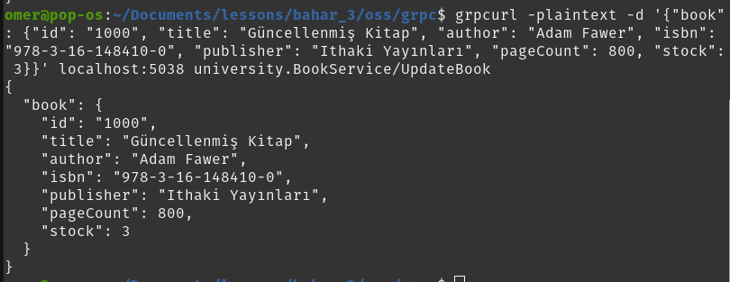

# grpcurl Testleri

> **Not:** Aşağıdaki komutları kullanmadan önce sunucuyu başlatmalısınız:
> 
> ```
> dotnet run --project src/server
> ```
>
> Eğer grpcurl yüklü değilse, [buradan indirin](https://github.com/fullstorydev/grpcurl#installation) veya Linux için:
> ```
> sudo apt install grpcurl
> # veya
> brew install grpcurl
> ```
> Sürüm önerisi: grpcurl v1.8.9 veya üzeri

Aşağıda, servislerin grpcurl ile test edilmesine dair örnek komutlar ve beklenen çıktılar yer almaktadır.

---

## BookService
Kitap ID'leri 1000'den başlar.

### Kitapları Listele (ListBooks)
```
grpcurl -plaintext localhost:5038 university.BookService/ListBooks
```


### Kitap Detay (GetBook)
```
grpcurl -plaintext -d '{"id": "1000"}' localhost:5038 university.BookService/GetBook
```


### Kitap Ekle (CreateBook)
```
grpcurl -plaintext -d '{"book": {"id": "1001", "title": "Test Book", "author": "Test Author", "isbn": "978-3-16-148410-0", "publisher": "Test Publisher", "pageCount": 100, "stock": 10}}' localhost:5038 university.BookService/CreateBook
```


### Kitap Güncelle (UpdateBook)
```
grpcurl -plaintext -d '{"book": {"id": "1000", "title": "Güncellenmiş Kitap", "author": "Adam Fawer", "isbn": "978-3-16-148410-0", "publisher": "Ithaki Yayınları", "pageCount": 800, "stock": 3}}' localhost:5038 university.BookService/UpdateBook
```


### Kitap Sil (DeleteBook)
```
grpcurl -plaintext -d '{"id": "1000"}' localhost:5038 university.BookService/DeleteBook
```


---

## StudentService
Öğrenci ID'leri 5000'den başlar.

### Öğrencileri Listele (ListStudents)
```
grpcurl -plaintext localhost:5038 university.StudentService/ListStudents
```


### Öğrenci Detay (GetStudent)
```
grpcurl -plaintext -d '{"id": "5000"}' localhost:5038 university.StudentService/GetStudent
```


### Öğrenci Ekle (CreateStudent)
```
grpcurl -plaintext -d '{"student": {"id": "5001", "name": "Omer Kavakli", "studentNumber": "12345678", "email": "omerkavakli@example.com", "isActive": true}}' localhost:5038 university.StudentService/CreateStudent
```


### Öğrenci Güncelle (UpdateStudent)
```
grpcurl -plaintext -d '{"student": {"id": "5000", "name": "Omer Kavakli", "studentNumber": "12345678", "email": "omerkavakli@example.com", "isActive": false}}' localhost:5038 university.StudentService/UpdateStudent
```


### Öğrenci Sil (DeleteStudent)
```
grpcurl -plaintext -d '{"id": "5000"}' localhost:5038 university.StudentService/DeleteStudent
```


---

## LoanService
Ödünç ID'leri 9000'den başlar.

### Ödünçleri Listele (ListLoans)
```
grpcurl -plaintext localhost:5038 university.LoanService/ListLoans
```


### Ödünç Detay (GetLoan)
```
grpcurl -plaintext -d '{"id": "9000"}' localhost:5038 university.LoanService/GetLoan
```


### Ödünç Al (BorrowBook)
```
grpcurl -plaintext -d '{"studentId": "5000", "bookId": "1000"}' localhost:5038 university.LoanService/BorrowBook
```


### Kitap İade Et (ReturnBook)
```
grpcurl -plaintext -d '{"loanId": "9000"}' localhost:5038 university.LoanService/ReturnBook
```


---

## Hatalı Durum Senaryoları

### Var olmayan öğrenci sorgulama (NotFound)
```
grpcurl -plaintext -d '{"id": "9999"}' localhost:5038 university.StudentService/GetStudent
```


### Aynı ID ile öğrenci ekleme (AlreadyExists)
```
grpcurl -plaintext -d '{"student": {"id": "5000", "name": "Test", "studentNumber": "111111111", "email": "test@example.com", "isActive": true}}' localhost:5038 university.StudentService/CreateStudent
```


### Eksik alan ile öğrenci ekleme (InvalidArgument)
```
grpcurl -plaintext -d '{"student": {"id": "", "name": "Test", "studentNumber": "111111111", "email": "test@example.com", "isActive": true}}' localhost:5038 university.StudentService/CreateStudent
```


### Var olmayan kitap silme (NotFound)
```
grpcurl -plaintext -d '{"id": "9999"}' localhost:5038 university.BookService/DeleteBook
```


### Aynı kitapla aktif ödünç alma (AlreadyExists)
```
grpcurl -plaintext -d '{"studentId": "5000", "bookId": "1000"}' localhost:5038 university.LoanService/BorrowBook
```


### Var olmayan ödünç sorgulama (NotFound)
```
grpcurl -plaintext -d '{"id": "9999"}' localhost:5038 university.LoanService/GetLoan
```


### Eksik loanId ile iade (InvalidArgument)
```
grpcurl -plaintext -d '{"loanId": ""}' localhost:5038 university.LoanService/ReturnBook
```


### Zaten iade edilmiş ödünç için iade denemesi (InvalidArgument)
```
grpcurl -plaintext -d '{"loanId": "<daha önce iade edilen ödünç id>"}' localhost:5038 university.LoanService/ReturnBook
```
